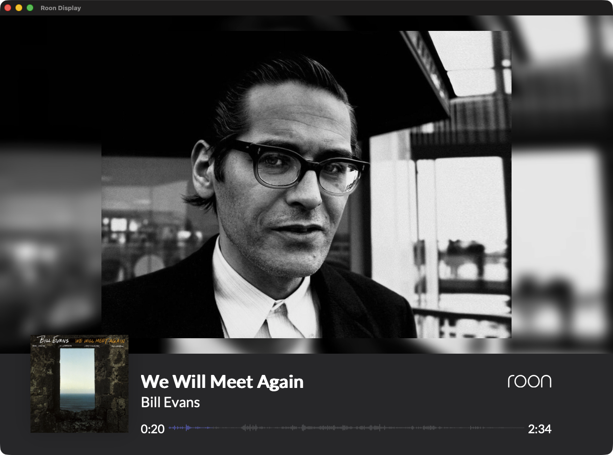
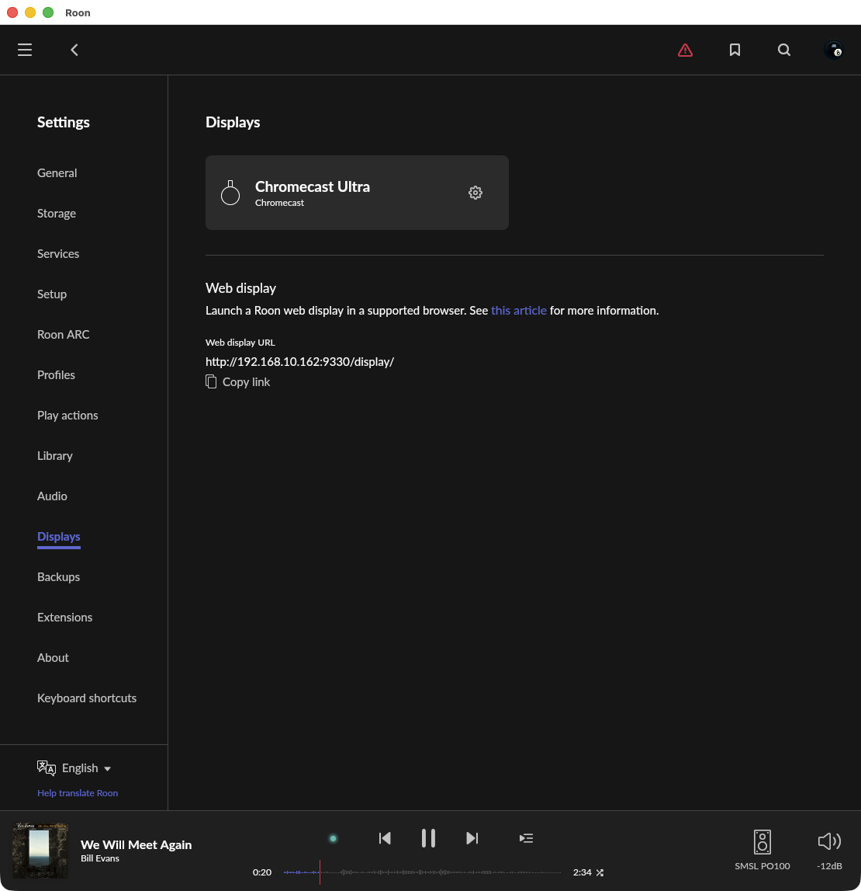

# RoonDisplay

macOS app that displays the [Roon](https://roon.app/) Display page in a dedicated full-screen window with burn-in prevention.



## Features

- Wraps `http://<roon-server>:9330/display/` in a WKWebView window
- Press `F` to toggle full-screen
- View menu: **Reload** (`⌘R`)
- **Burn-in prevention**: shows a pure black overlay after configurable idle timeout (default: 300 s)
  - Identifies the displayed zone by intercepting Roon's own `console.log` output (`display zone callback: <zone_id>`)
  - Zone ID persisted to UserDefaults — filtering is active immediately on restart, even if the zone is already paused
  - Activity timer resets only when `zones_seek_changed` events contain the displayed zone's ID; paused zones emit no seek events
  - Multi-zone safe: seek events from background zones are ignored
  - Overlay fades in (1.5 s) on idle, fades out (0.5 s) on resume

## Requirements

- macOS 10.15+ (Intel) / macOS 11+ (Apple Silicon)
- Xcode Command Line Tools (`xcode-select --install`)

## Build & Install

```sh
git clone https://github.com/soresore19xx/roon-display.git
cd roon-display
bash ./build.sh
```

This produces:
- `RoonDisplay.app` — installed to `/Applications/`
- `RoonDisplay.dmg` — distributable image

## Configuration

> **First-time setup required**: The default Display URL is a placeholder. You must change it to your Roon Server's IP address before use.

Launch the app and open **Preferences…** (`⌘,`):

| Setting | Default | Description |
|---|---|---|
| Display URL | `http://192.168.1.100:9330/display/` | **Change to your Roon Server IP** |
| Idle timeout (s) | `300` | Seconds before burn-in overlay appears |

**Finding the URL**: open Roon → **Settings** → **Displays** → copy the **Web display URL** shown at the bottom of the page.



Settings are saved to `UserDefaults` and persist across restarts.

## Burn-in Prevention — Technical Notes

Roon's WebSocket uses the **MOO/1** binary protocol (Blob frames, UTF-8 decodable).

| Message | While displayed zone is paused | Handling |
|---|---|---|
| `zones_seek_changed` | Stops | Activity heartbeat — ping only if displayed zone ID matches |
| `zones_changed` | Continues for all zones | Ignored — multi-zone payloads make it unreliable for zone-specific filtering |
| `WaveformChanged` / `LyricsChanged` | Continues for all zones | Ignored |

The injected `monitorJS` script runs at `atDocumentStart` and:

1. Replaces `window.WebSocket` with a patched constructor that intercepts all incoming messages
2. Intercepts `console.log` to capture `display zone callback: <zone_id>` — Roon's own zone identification output — and saves it via `roonZoneId` to `UserDefaults`
3. On each `zones_seek_changed` message, pings Swift (`roonActivity`) only if the message contains the stored zone ID

**Zone ID**: Restored from `UserDefaults` at launch, so multi-zone filtering is active immediately even when the zone is already paused. On the very first launch (no stored ID), all seek events are treated as activity until the first `display zone callback` is received.

**WKWebView compatibility**: Two scripts are injected at document start:
- `visibilityState` / `hidden` overrides — WKWebView may report `hidden`, causing Roon's JS to skip WebSocket initialization
- Chrome user agent — ensures Roon serves the standard display page
